# Gallery

See what WhateverOPS looks like before you clone it. Every screenshot is real — 16 integrations running in a single dashboard.

---

## The Dashboard

One glance. Everything you run. Revenue, health, users, costs, and what needs your attention — all in real time.

  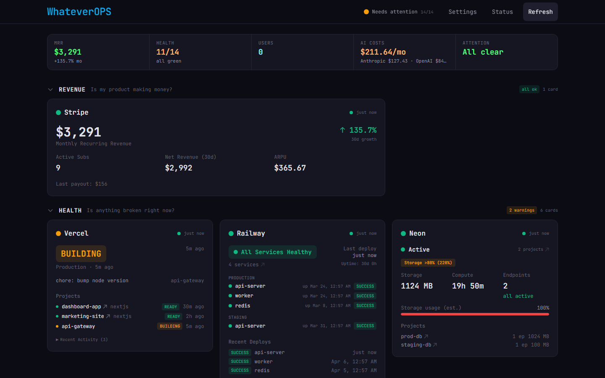

---

## Revenue

_Is my product making money?_

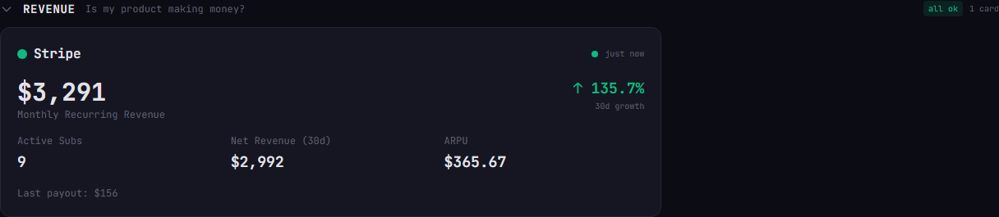

### Stripe

MRR, active subscriptions, net revenue, ARPU, growth trends, and recent charges — all from your Stripe secret key.

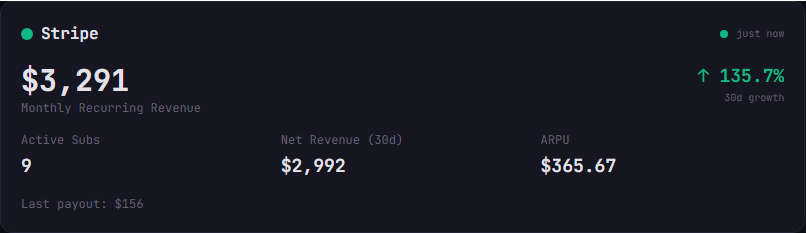

---

## Health

_Is anything broken right now?_

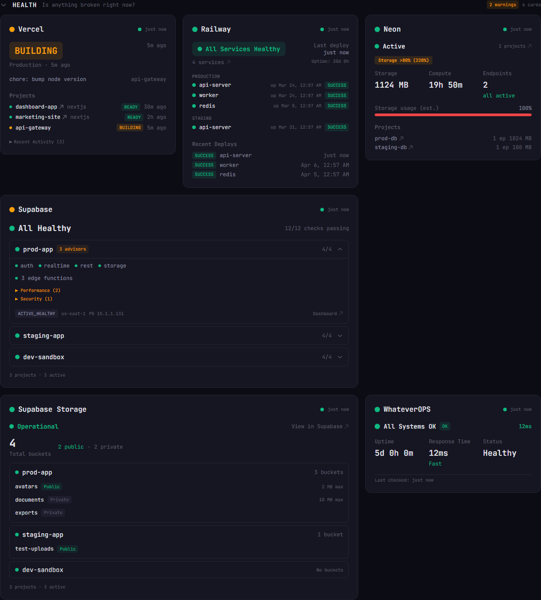

### Vercel

Production deploy status, project list, and recent activity across all your Vercel projects.

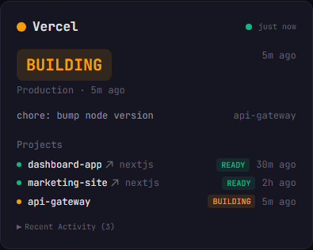

### Railway

Service health, deploy status, and uptime for every project and service on Railway.

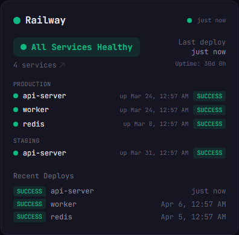

### Neon

Database projects, storage usage, compute time, and endpoint status.

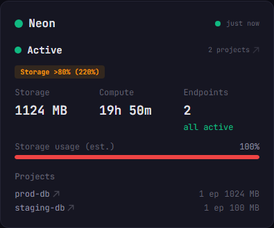

### Supabase

Project health, advisors (performance + security), and edge functions — across all your Supabase projects. One access token powers three cards.

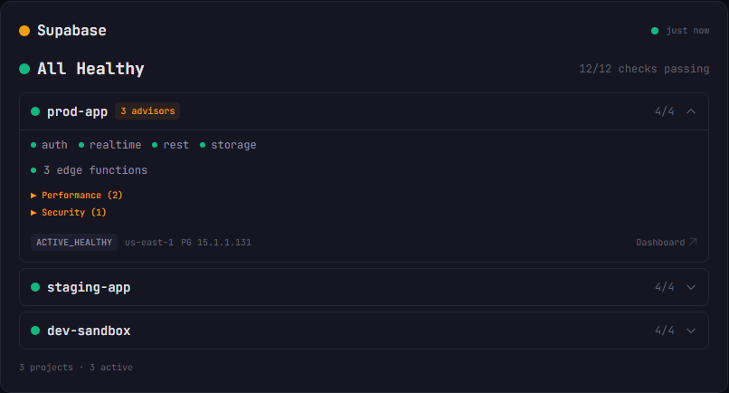

Expanded — advisors and edge functions

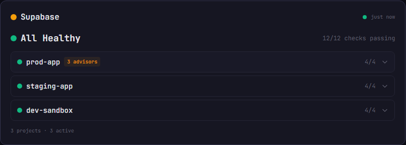

### Supabase Storage

Buckets per project with visibility badges and file size limits.

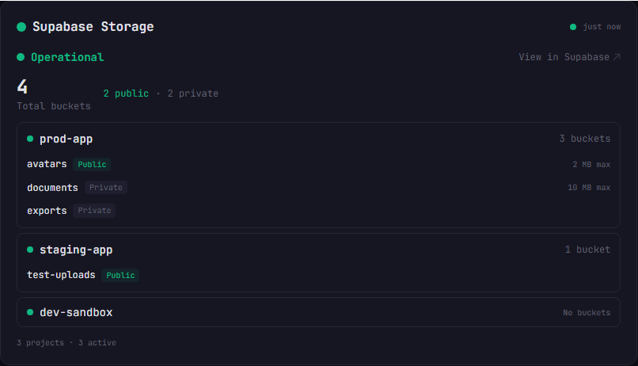

### Self-Monitoring

WhateverOPS monitors itself — uptime, response time, and system health.

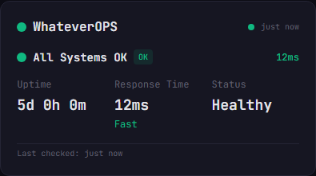

---

## Users

_Are people using it?_

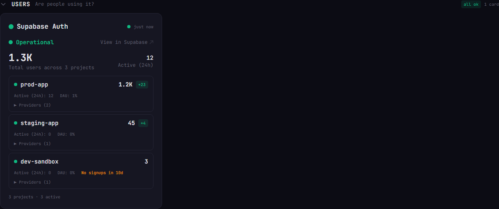

### Supabase Auth

Total users, signups, DAU, and provider breakdown — per project, auto-discovered.

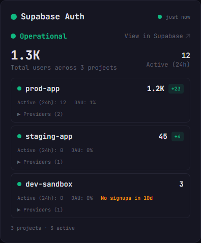

---

## Costs

_Am I burning too much?_

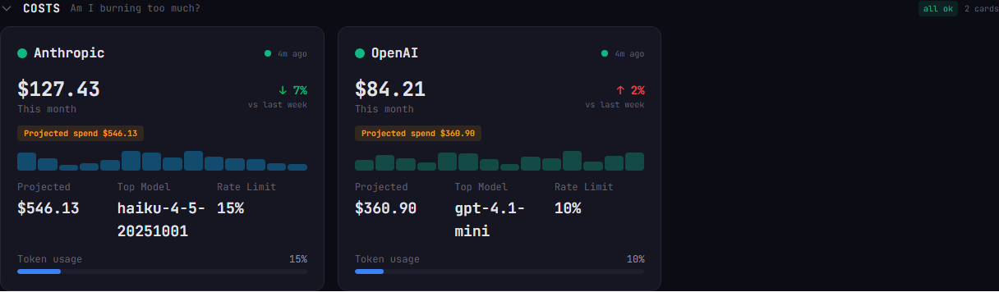

### Anthropic

Monthly spend, daily cost trend, model usage breakdown, and rate limit status.

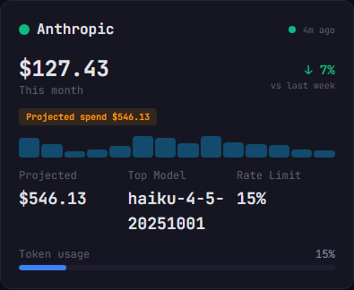

### OpenAI

Same depth — total cost, daily spend chart, model-level token usage, and projected monthly burn.

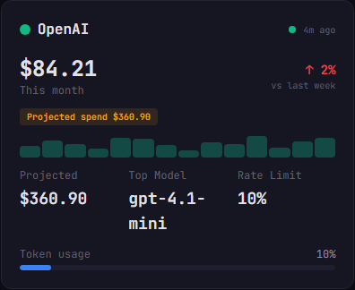

---

## Attention

_What needs my attention today?_

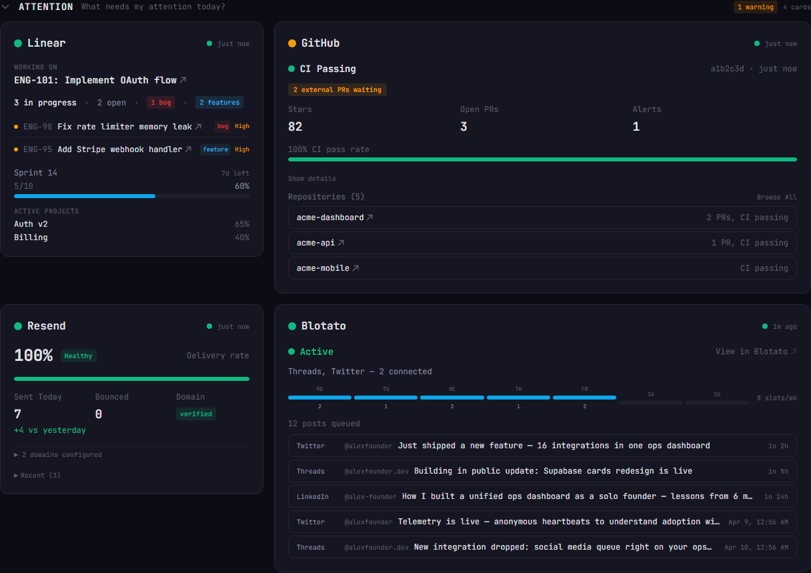

### Linear

Current sprint, in-progress issues, active projects, and cycle progress.

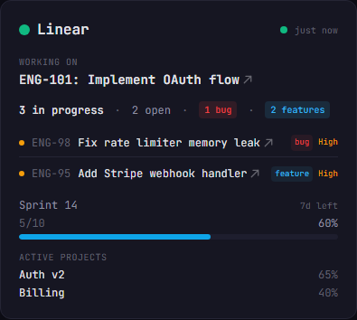

### GitHub

CI status, stars, open PRs, alerts, and per-repo activity — aggregated across all your repositories.

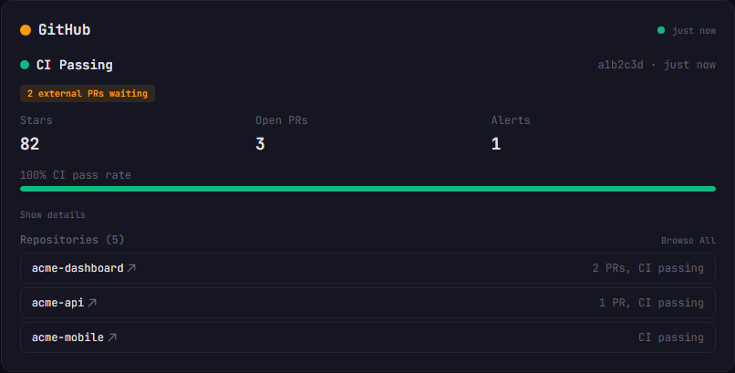

### Resend

Delivery rate, emails sent today vs yesterday, domain status, and recent sends.

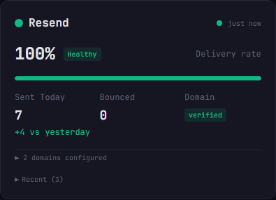

### Blotato

Social media pipeline — connected accounts, posting schedule, queue depth, and upcoming posts.

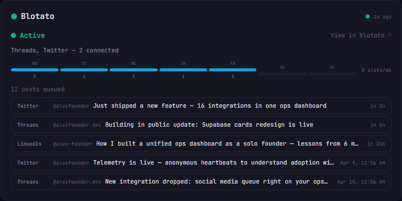

---

## Full Dashboard

The complete view — scroll through every section.

  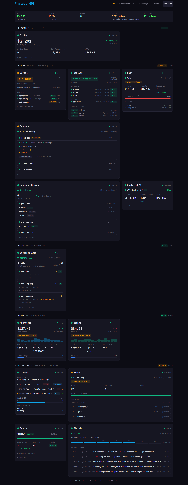

